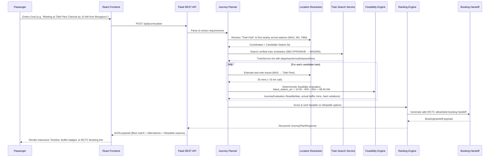
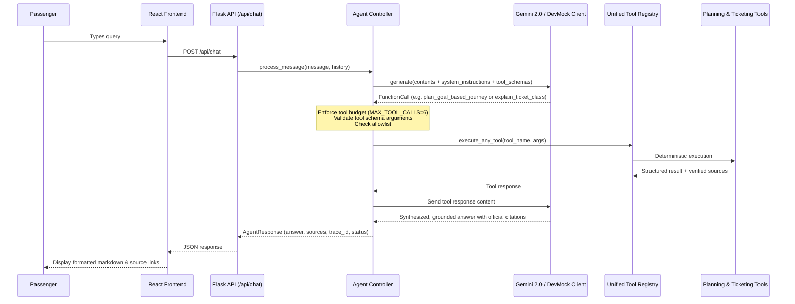

# DATA FLOW — RailSathi AI

> Last updated: 2026-10-10

## Goal-Based Journey Planning Lifecycle

```mermaid
sequenceDiagram
    participant P as Passenger
    participant FE as React Frontend
    participant API as Flask REST API
    participant PLAN as Journey Planner
    participant LOC as Location Resolution
    participant TT as Train Search Service
    participant FEAS as Feasibility Engine
    participant RANK as Ranking Engine
    participant BOOK as Booking Handoff

    P->>FE: Enters Goal (e.g. "Meeting at Tidel Park Chennai by 10 AM from Bengaluru")
    FE->>API: POST /api/journey/plan
    API->>PLAN: Parse & extract requirements

    PLAN->>LOC: Resolve "Tidel Park" & find nearby arrival stations (MAS, MS, TBM)
    LOC-->>PLAN: Coordinates + Candidate Station list

    PLAN->>TT: Search verified train schedules (SBC/YPR/SMVB → MAS/MS)
    TT-->>PLAN: TrainService list with departure/arrival/classes/fares

    loop For each candidate train
        PLAN->>LOC: Estimate last-mile transit (MAS → Tidel Park)
        LOC-->>PLAN: 35 mins (~15 km cab)
        PLAN->>FEAS: Deterministic feasibility evaluation<br/>latest_station_arr = 10:00 - 45m - 35m = 08:40 AM
        FEAS-->>PLAN: JourneyEvaluation (feasible/late, actual buffer mins, hard violations)
    end

    PLAN->>RANK: Score & rank feasible vs infeasible options
    RANK->>BOOK: Generate safe IRCTC allowlisted booking handoff
    BOOK-->>RANK: BookingHandoff payload
    RANK-->>API: Structured JourneyPlanResponse
    API-->>FE: JSON payload (Best match + Alternatives + Infeasible reasons)
    FE-->>P: Render interactive Timeline, Buffer badges, & IRCTC Booking link
```

## AI Agent Controller Lifecycle

```mermaid
sequenceDiagram
    participant P as Passenger
    participant FE as React Frontend
    participant API as Flask API (/api/chat)
    participant CTRL as Agent Controller
    participant LLM as Gemini 2.0 / DevMock Client
    participant REG as Unified Tool Registry
    participant TOOLS as Planning & Ticketing Tools

    P->>FE: Types query
    FE->>API: POST /api/chat
    API->>CTRL: process_message(message, history)

    CTRL->>LLM: generate(contents + system_instructions + tool_schemas)
    LLM-->>CTRL: FunctionCall (e.g. plan_goal_based_journey or explain_ticket_class)

    Note over CTRL: Enforce tool budget (MAX_TOOL_CALLS=6)<br/>Validate tool schema arguments<br/>Check allowlist

    CTRL->>REG: execute_any_tool(tool_name, args)
    REG->>TOOLS: Deterministic execution
    TOOLS-->>REG: Structured result + verified sources
    REG-->>CTRL: Tool response

    CTRL->>LLM: Send tool response content
    LLM-->>CTRL: Synthesized, grounded answer with official citations
    CTRL-->>API: AgentResponse (answer, sources, trace_id, status)
    API-->>FE: JSON response
    FE-->>P: Display formatted markdown & source links
```
