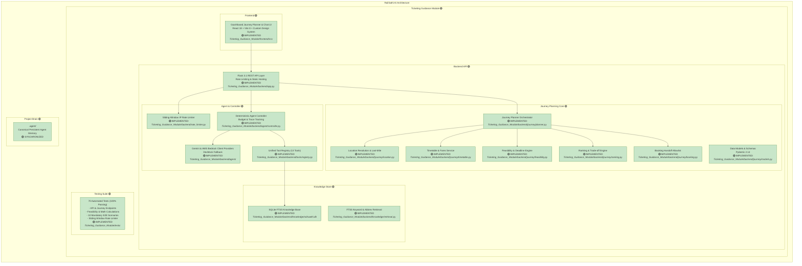

# PROJECT TREE — RailSathi AI

> Last updated: 2026-10-10
> Legend: 🟢 IMPLEMENTED & VERIFIED | 🟡 PARTIAL | ⚪ PLANNED | 🔴 BLOCKED

```mermaid
graph TB
    subgraph "RailSathi AI Architecture"
        direction TB

        subgraph "Ticketing Guidance Module 🟢"
            direction TB
            subgraph "Frontend 🟢"
                UI["Goal-Based Journey Planner & Chat UI<br/>React 18 + Vite 8 + Custom Design System<br/>🟢 IMPLEMENTED<br/><i>Ticketing_Guidance_Module/frontend/src/</i>"]
            end

            subgraph "Backend API 🟢"
                API["Flask 3.1 REST API Layer<br/>Rate Limiting & Static Hosting<br/>🟢 IMPLEMENTED<br/><i>Ticketing_Guidance_Module/backend/app.py</i>"]

                subgraph "Journey Planning Core 🟢"
                    MOD["Data Models & Schemas<br/>Pydantic 2.14<br/>🟢 IMPLEMENTED<br/><i>Ticketing_Guidance_Module/backend/journey/models.py</i>"]
                    LOC["Location Resolution & Last-Mile<br/>🟢 IMPLEMENTED<br/><i>Ticketing_Guidance_Module/backend/journey/location.py</i>"]
                    TT["Timetable & Fares Service<br/>🟢 IMPLEMENTED<br/><i>Ticketing_Guidance_Module/backend/journey/timetable.py</i>"]
                    FEAS["Feasibility & Deadline Engine<br/>🟢 IMPLEMENTED<br/><i>Ticketing_Guidance_Module/backend/journey/feasibility.py</i>"]
                    RANK["Ranking & Trade-off Engine<br/>🟢 IMPLEMENTED<br/><i>Ticketing_Guidance_Module/backend/journey/ranking.py</i>"]
                    BOOK["Booking Handoff Allowlist<br/>🟢 IMPLEMENTED<br/><i>Ticketing_Guidance_Module/backend/journey/booking.py</i>"]
                    PLAN["Journey Planner Orchestrator<br/>🟢 IMPLEMENTED<br/><i>Ticketing_Guidance_Module/backend/journey/planner.py</i>"]
                end

                subgraph "Agent & Controller 🟢"
                    CTRL["Deterministic Agent Controller<br/>Budget & Trace Tracking<br/>🟢 IMPLEMENTED<br/><i>Ticketing_Guidance_Module/backend/agent/controller.py</i>"]
                    LLM["Gemini & AWS Bedrock Client Providers<br/>DevMock Fallback<br/>🟢 IMPLEMENTED<br/><i>Ticketing_Guidance_Module/backend/agent/</i>"]
                    REG["Unified Tool Registry (13 Tools)<br/>🟢 IMPLEMENTED<br/><i>Ticketing_Guidance_Module/backend/tools/registry.py</i>"]
                    RL["Sliding-Window IP Rate Limiter<br/>🟢 IMPLEMENTED<br/><i>Ticketing_Guidance_Module/backend/rate_limiter.py</i>"]
                end

                subgraph "Knowledge Store 🟢"
                    KS["SQLite FTS5 Knowledge Base<br/>🟢 IMPLEMENTED<br/><i>Ticketing_Guidance_Module/backend/knowledge/railsaathi.db</i>"]
                    RET["FTS5 Keyword & Abbrev Retrieval<br/>🟢 IMPLEMENTED<br/><i>Ticketing_Guidance_Module/backend/knowledge/retrieval.py</i>"]
                end
            end

            subgraph "Testing Suite 🟢"
                TESTS["70 Automated Tests (100% Passing)<br/>- API & Journey Endpoints<br/>- Feasibility & Math Calculations<br/>- 10 Mandatory E2E Scenarios<br/>- Sliding Window Rate Limiter<br/>🟢 IMPLEMENTED<br/><i>Ticketing_Guidance_Module/tests/</i>"]
            end
        end

        subgraph "Project Brain 🟢"
            PB[".agent/<br/>Canonical Persistent Agent Memory<br/>🟢 SYNCHRONIZED"]
        end
    end

    UI --> API
    API --> RL
    API --> PLAN
    API --> CTRL
    PLAN --> LOC
    PLAN --> TT
    PLAN --> FEAS
    PLAN --> RANK
    PLAN --> BOOK
    CTRL --> LLM
    CTRL --> REG
    REG --> KS

    style UI fill:#c8e6c9,stroke:#2e7d32
    style API fill:#c8e6c9,stroke:#2e7d32
    style MOD fill:#c8e6c9,stroke:#2e7d32
    style LOC fill:#c8e6c9,stroke:#2e7d32
    style TT fill:#c8e6c9,stroke:#2e7d32
    style FEAS fill:#c8e6c9,stroke:#2e7d32
    style RANK fill:#c8e6c9,stroke:#2e7d32
    style BOOK fill:#c8e6c9,stroke:#2e7d32
    style PLAN fill:#c8e6c9,stroke:#2e7d32
    style CTRL fill:#c8e6c9,stroke:#2e7d32
    style LLM fill:#c8e6c9,stroke:#2e7d32
    style REG fill:#c8e6c9,stroke:#2e7d32
    style RL fill:#c8e6c9,stroke:#2e7d32
    style KS fill:#c8e6c9,stroke:#2e7d32
    style RET fill:#c8e6c9,stroke:#2e7d32
    style TESTS fill:#c8e6c9,stroke:#2e7d32
    style PB fill:#c8e6c9,stroke:#2e7d32
```
