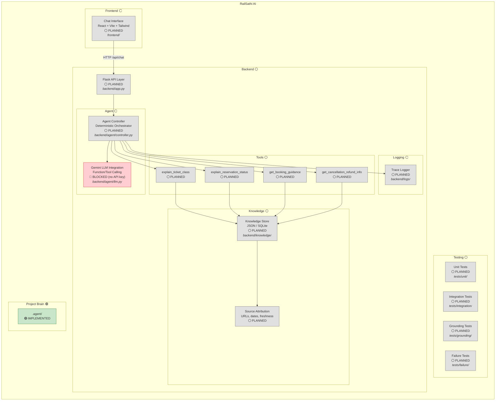

# PROJECT TREE — RailSathi AI

> Last updated: 2026-10-10
> Legend: 🟢 IMPLEMENTED | 🟡 PARTIAL | ⚪ PLANNED | 🔴 BLOCKED

```mermaid
graph TB
    subgraph "RailSathi AI"
        direction TB

        subgraph "Frontend ⚪"
            UI["Chat Interface<br/>React + Vite + Tailwind<br/>⚪ PLANNED<br/><i>frontend/</i>"]
        end

        subgraph "Backend ⚪"
            API["Flask API Layer<br/>⚪ PLANNED<br/><i>backend/app.py</i>"]

            subgraph "Agent ⚪"
                CTRL["Agent Controller<br/>Deterministic Orchestrator<br/>⚪ PLANNED<br/><i>backend/agent/controller.py</i>"]
                LLM["Gemini LLM Integration<br/>Function/Tool Calling<br/>🔴 BLOCKED (no API key)<br/><i>backend/agent/llm.py</i>"]
            end

            subgraph "Tools ⚪"
                T1["explain_ticket_class<br/>⚪ PLANNED"]
                T2["explain_reservation_status<br/>⚪ PLANNED"]
                T3["get_booking_guidance<br/>⚪ PLANNED"]
                T4["get_cancellation_refund_info<br/>⚪ PLANNED"]
            end

            subgraph "Knowledge ⚪"
                KS["Knowledge Store<br/>JSON / SQLite<br/>⚪ PLANNED<br/><i>backend/knowledge/</i>"]
                SA["Source Attribution<br/>URLs, dates, freshness<br/>⚪ PLANNED"]
            end

            subgraph "Logging ⚪"
                LOG["Trace Logger<br/>⚪ PLANNED<br/><i>backend/logs/</i>"]
            end
        end

        subgraph "Testing ⚪"
            TU["Unit Tests<br/>⚪ PLANNED<br/><i>tests/unit/</i>"]
            TI["Integration Tests<br/>⚪ PLANNED<br/><i>tests/integration/</i>"]
            TG["Grounding Tests<br/>⚪ PLANNED<br/><i>tests/grounding/</i>"]
            TF["Failure Tests<br/>⚪ PLANNED<br/><i>tests/failure/</i>"]
        end

        subgraph "Project Brain 🟢"
            PB[".agent/<br/>🟢 IMPLEMENTED"]
        end
    end

    UI -->|"HTTP /api/chat"| API
    API --> CTRL
    CTRL --> LLM
    CTRL --> T1
    CTRL --> T2
    CTRL --> T3
    CTRL --> T4
    T1 --> KS
    T2 --> KS
    T3 --> KS
    T4 --> KS
    KS --> SA
    CTRL --> LOG

    style UI fill:#e0e0e0,stroke:#666
    style API fill:#e0e0e0,stroke:#666
    style CTRL fill:#e0e0e0,stroke:#666
    style LLM fill:#ffcdd2,stroke:#c62828
    style T1 fill:#e0e0e0,stroke:#666
    style T2 fill:#e0e0e0,stroke:#666
    style T3 fill:#e0e0e0,stroke:#666
    style T4 fill:#e0e0e0,stroke:#666
    style KS fill:#e0e0e0,stroke:#666
    style SA fill:#e0e0e0,stroke:#666
    style LOG fill:#e0e0e0,stroke:#666
    style TU fill:#e0e0e0,stroke:#666
    style TI fill:#e0e0e0,stroke:#666
    style TG fill:#e0e0e0,stroke:#666
    style TF fill:#e0e0e0,stroke:#666
    style PB fill:#c8e6c9,stroke:#2e7d32
```
